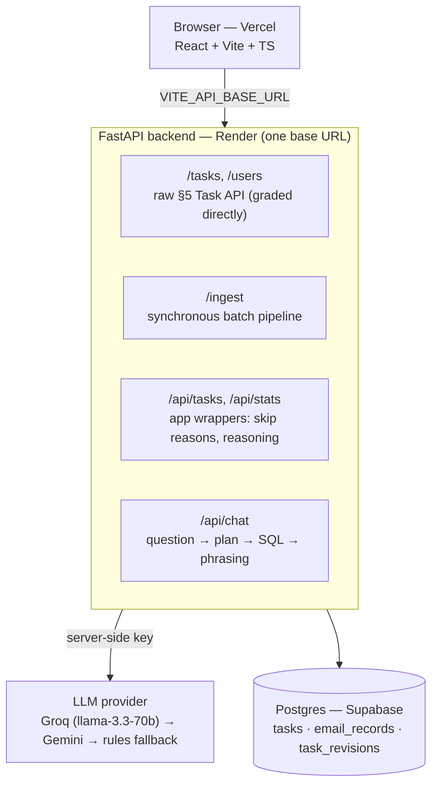
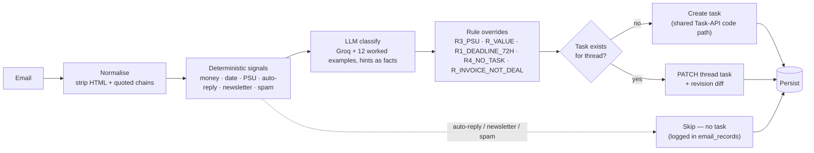

# Sales Inbox → Task Router

An agent that reads a B2B `sales@` inbox (150–250 emails/day), routes each email to
the right owner (or correctly drops the noise), persists every decision with its
reasoning, and gives the ops team one page to watch it work and **ask grounded
questions** about it.

---

## Submission details — paste these into the form byte-identical

| | |
|---|---|
| **candidate_id** | `manviitnd0408@gmail.com` |
| **Backend base URL** | `https://sales-inbox-task-router-ix9b.onrender.com` |
| **Frontend URL** | `https://sales-inbox-task-router-five.vercel.app` |
| **Short demo (video)** | [1-minute walkthrough](https://drive.google.com/file/d/1iJWWx1oRiTqb7USYZ1lYTIMksfb5JNhq/view?usp=sharing) |

> These URLs are live and must be **byte-identical** to what you enter in the submission
> form. `candidate_id` is defined once as an env var (`CANDIDATE_ID`) — never hardcoded.

---

## What it does

- **`POST /ingest`** takes a batch (≤100), classifies each email through a
  deterministic-first, LLM-second, deterministic-override-last pipeline, and writes
  tasks to its own Task API **synchronously** — it returns only after every task is
  committed.
- The **Task API** (`/tasks`, `/users`) is the exact §5 spec the grader calls directly,
  backed by **Postgres** so data survives cold restarts.
- The **chat** (`/api/chat`) answers questions by having the LLM emit a *structured
  query plan*, executing parameterised SQL/aggregation in our code, then having the LLM
  *phrase the numbers we computed*. The model never produces a number, so the same question
  twice returns identical figures, and zero / "I don't have that" are first-class answers.

The LLM provider is pluggable: **Groq (Llama-3.3-70B) is primary, Gemini is a fallback, and a
pure-rules classifier is the last resort** so an email is never dropped when the LLM is down.

## Architecture

**System — one backend base URL; the browser never sees the LLM key or the DB.**



**Per-email pipeline — deterministic first, LLM second, deterministic overrides last.**



## Quickstart

**Backend** (from `backend/`):

```bash
cp .env.example .env   # then edit .env: DATABASE_URL + GROQ_API_KEY (or GEMINI_API_KEY)
pip install -r requirements.txt
uvicorn app.main:app --reload
```

**Frontend** (from `frontend/`):

```bash
cp .env.example .env   # set VITE_API_BASE_URL to your backend URL
npm install
npm run dev
```

Open http://localhost:5173. With no `DATABASE_URL`, the backend falls back to SQLite
for local dev; **grading requires Postgres** (set `DATABASE_URL`).

## Endpoints (all under the one base URL)

| Method | Path | Purpose |
|---|---|---|
| `POST` | `/tasks` | Create a task. Validates enums → exact `invalid_enum_value` 400. Dedups on `(candidate_id, source_email_id)` → 200 with the existing task. |
| `PATCH` | `/tasks/{id}` | Update mutable fields; returns full task; writes a `task_revisions` row. |
| `GET` | `/tasks?candidate_id=` | Raw §5 shape. Optional `thread_id`, `source_email_id`, `assignee_id`. |
| `DELETE` | `/tasks/{id}` | Single delete. |
| `GET` | `/users` | The §3.2 roster. |
| `POST` | `/ingest` | `{candidate_id, emails[]}` (≤100). Synchronous. Returns `{processed, tasks_created, tasks_updated, skipped, errors[]}`. |
| `GET` | `/api/tasks` | Processing ledger: every email (incl. skipped) joined with its task, reasoning, rules fired, revisions. |
| `GET` | `/api/stats` | Aggregates by category / assignee / skip reason / run, plus spurious rate + latency/token roll-ups. |
| `POST` | `/api/chat` | `{candidate_id, query, run_id?}` → `{answer, supporting_data, query}`. |

## Routing rules implemented

- `R3_PSU` — PSU/government tender → `u_aarti` / `enterprise_rfp`, **beats the value threshold**.
- `R_VALUE` — sales enquiry with a stated value: `> ₹10,00,000` → Aarti, `≤` → Rohit. Never for marketing/alliances/finance.
- `R1_DEADLINE_72H` — a stated deadline within 72h of `received_at` → `priority: high`.
- `R4_NO_TASK` — auto-reply / newsletter / outbound vendor spam → **no task** (not a triage task).
- `R_INVOICE_NOT_DEAL` — an invoice/PO amount is never `deal_value_inr`; finance tasks get `null`.
- Two legitimate owners on one email → `u_triage`, confidence < 0.55, both asks in the description.
- `FALLBACK_NO_LLM` — if Gemini fails after 3 retries, a pure-rules classifier routes it (confidence ≤ 0.35) so **an email is never dropped**.

## Testing

```bash
cd backend && pytest                         # 33 unit tests (parsers, rules, detectors)
python scripts/selftest.py <BACKEND_URL>     # 3 grading scenarios + enum + chat traps
python scripts/eval.py    <BACKEND_URL>      # precision/recall/F1 + confidence calibration
```

The frontend has a **Run self-test** button that posts the twelve §6 worked examples to
the live backend and renders expected-vs-actual for each.

## Deployment

1. **Postgres (Supabase):** create a free project → copy the **connection pooling** URI →
   set it as `DATABASE_URL` (the code rewrites the driver to `postgresql+psycopg://`).
2. **Backend (Render):** New → Blueprint on this repo (`render.yaml`, `rootDir: backend`).
   Set env vars in the dashboard: `DATABASE_URL`, `GROQ_API_KEY`, `CORS_ORIGINS`
   (your Vercel origin). Start command: `uvicorn app.main:app --host 0.0.0.0 --port $PORT`.
3. **Frontend (Vercel):** import repo, root directory `frontend`, set
   `VITE_API_BASE_URL` to the Render URL. `vercel.json` handles the SPA build.

## Security

- The LLM key (`GROQ_API_KEY` / `GEMINI_API_KEY`) is read **server-side only**. The browser
  never sees it and never talks to the DB. Check the Network tab — only `/api/*`, `/ingest`,
  `/tasks` calls, no key.
- `.env` is git-ignored; only `.env.example` is committed. No secrets in the repo.

## Repo layout

```
backend/   FastAPI app (app/), pipeline/ (normalise, parsers, detectors, rules, prompt, classifier), tests/
frontend/  Vite + React + TS single page (hero, input, raw table, results, chat, self-test)
fixtures/  worked_examples.json (the 12 §6 cases), eval_set.json (55 hand-labelled)
scripts/   selftest.py (grading scenarios), eval.py (P/R/F1 + calibration)
README.md  EVALS.md  DECISIONS.md
```

See [EVALS.md](EVALS.md) for measured accuracy and honest failure cases, and
[DECISIONS.md](DECISIONS.md) for the engineering tradeoffs.
